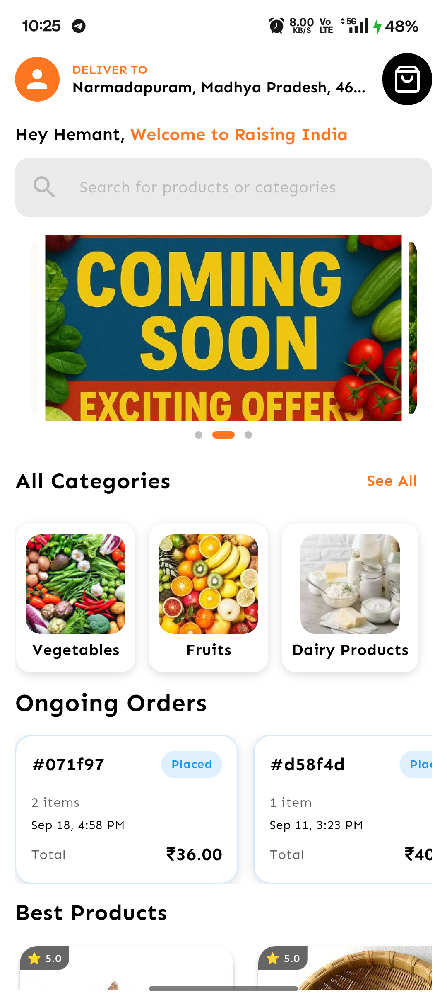
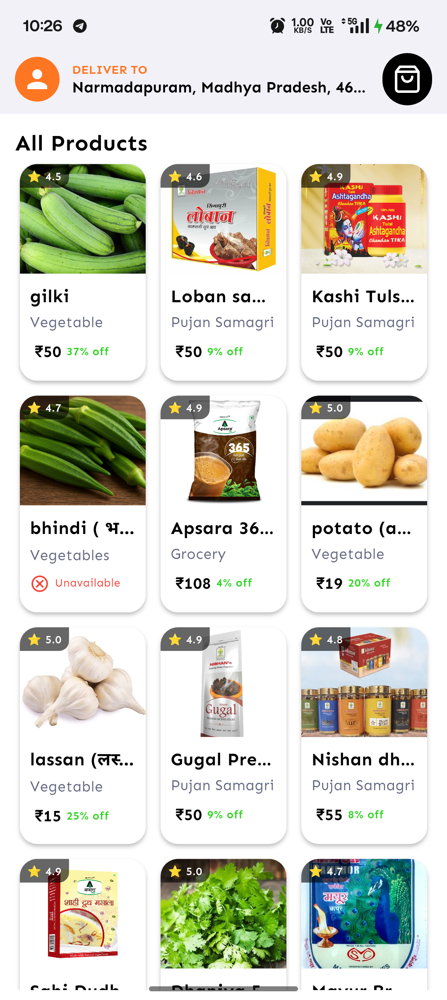
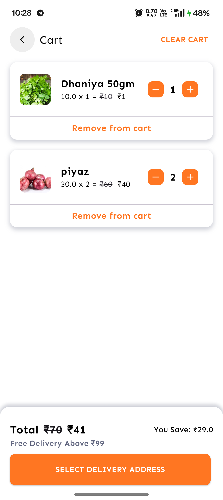
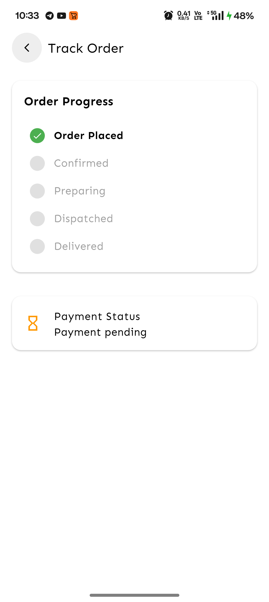
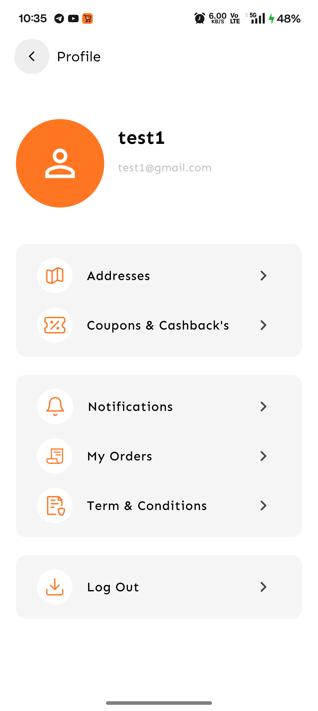
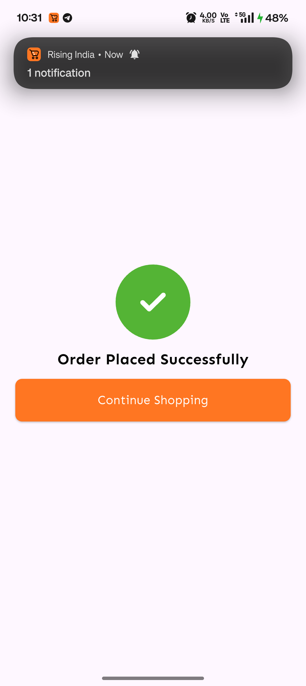
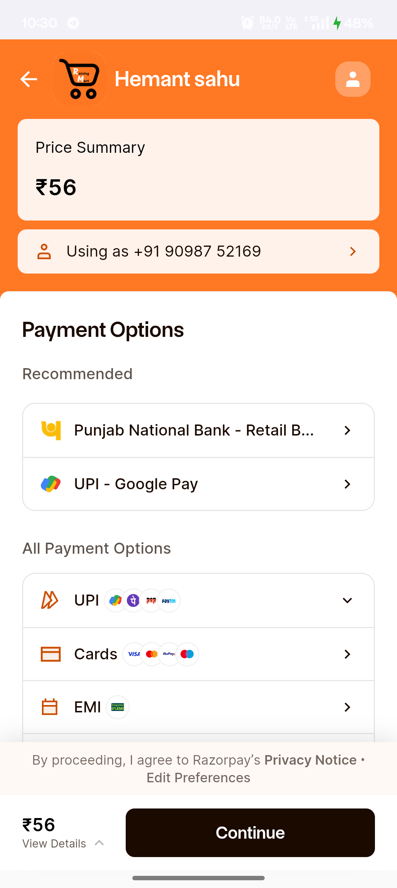
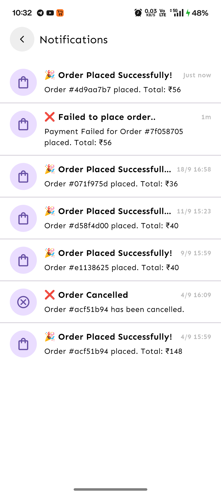
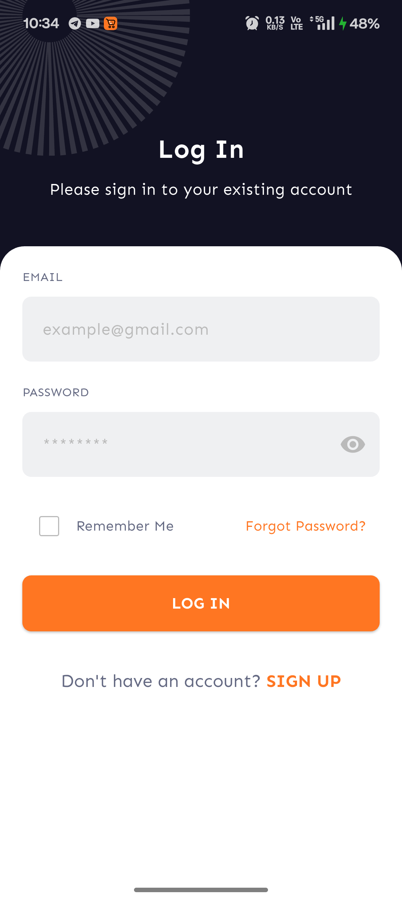

# 🛒 Rising Mart – Grocery Delivery App

Rising Mart is a **full-featured grocery delivery application** built with **Flutter** and **Firebase**, inspired by popular apps like **Blinkit, Zepto, and BigBasket**.  
It provides users with a **fast, smooth, and reliable shopping experience** — from browsing groceries to doorstep delivery.

---

## ✨ Features

- 👤 **User Authentication** – Sign up, Login, Profile Management
- 🛍 **Browse & Search Products** – Categories, Filters & Smart Search
- 🛒 **Cart & Checkout** – Smooth order placement
- 💳 **Multiple Payment Methods** – UPI, Wallet, COD, Razorpay
- 📍 **Location-based Delivery** – Save & manage delivery addresses
- 🚚 **Order Tracking** – Real-time status updates
- 🔔 **Push Notifications** – Offers, order updates & reminders
- 🌙 **Dark/Light Theme** – Personalized experience
- 📊 **Admin Panel** – Manage Products, Users, Sales & Orders

---

## 📸 Screenshots

| Home | Product Details                          | Cart | Order Tracking                           | Profile |
|------|------------------------------------------|------|------------------------------------------|---------|
|  |  |  |  |  |

 | Checkout | Order Confirmation                               | Payment | Notfication                                    |
 |----------|--------------------------------------------------| -------- |------------------------------------------------|
 |  |  |  |  |

  | LogIn | Forgot Password | Sign Up | Profile | 
  | -------| ---------------| --------| --------|
  |  |  |  |  |
*(Add your screenshots inside `/screenshots/` and link them here)*

---

## 🏗 Tech Stack

- **Frontend:** Flutter (Dart)
- **Backend:** Firebase (Authentication, Firestore, Storage, Cloud Functions)
- **Payments:** UPI, Razorpay, COD
- **Push Notifications:** Firebase Cloud Messaging (FCM)
- **State Management:** BLoC & Cubit

---

## 🚀 Getting Started

### ✅ Prerequisites
- Flutter SDK
- Android Studio / VS Code
- Firebase Project Setup

### ⚡ Installation

```bash
# Clone the repository
git clone https://github.com/Hemant-05/Rising-India.git
cd raising_india

# Install dependencies
flutter pub get

# Run the app
flutter run

```

## 🔧 Firebase Configuration

Add google-services.json → /android/app/

Add GoogleService-Info.plist → /ios/Runner/

Set up Firestore collections: users, products, orders

Enable Firebase Storage for product images

Configure Cloud Functions for order handling (optional)

## 📌 Roadmap

🎁 Referral & Rewards System

📦 Subscription Model (daily groceries – milk, bread, etc.)

🌍 Multi-language Support (English / Hindi)

🚴 Delivery Partner App

🤝 Contributing

Contributions are always welcome!

Fork the repo

Create a feature branch → git checkout -b feature-name

Commit changes → git commit -m "Added new feature"

Push to branch → git push origin feature-name

Open a Pull Request

## 📜 License

This project is licensed under the MIT License – see the LICENSE
file for details.

## 👨‍💻 Author

Hemant Sahu

🌐 [LinkedIn](www.linkedin.com/in/hemant-sahu-06234324a)

💻 [GitHub](www.github.com/Hemant-05)